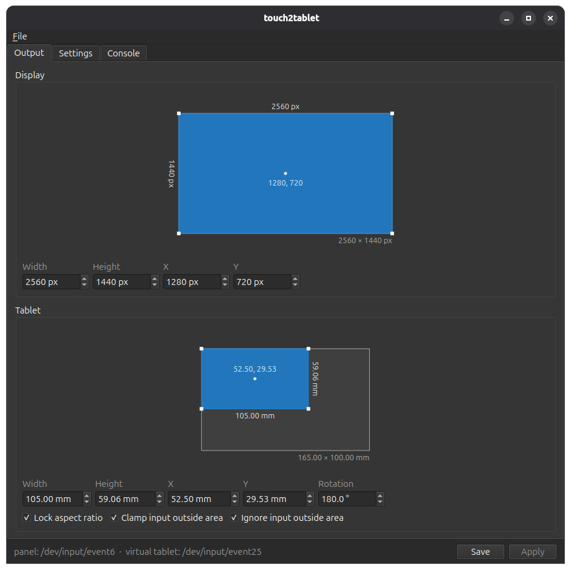
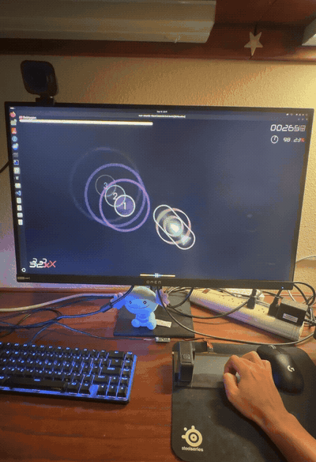

# touch2tablet

User mode daemon and [OpenTabletDriver](https://github.com/OpenTabletDriver/OpenTabletDriver)-style GUI that turns a multitouch panel into an absolute-positioned tablet. Supports Linux and Windows; see [Windows setup and limitations](docs/windows.md).



*GUI*



*Using touch2tablet to play osu! on a 165 × 100 mm GT911 touchscreen controller*

## Supported Hardware

See [Supported Panels](docs/supported-panels.md) for compatible devices and steps for adding one.

## Quick Start (Linux)

touch2tablet requires Linux with udev and a systemd user session, CMake >=3.22,
Ninja, a C++20 compiler, Qt >=6.5, `pkg-config`, and libevdev.
On Debian-based distributions, install the build dependencies with:

```bash
sudo apt install build-essential cmake ninja-build pkg-config qt6-base-dev libevdev-dev
./scripts/install-user.sh
```

Then, plug in a supported panel and the service should grab it and present
"touch2tablet Pen Tablet". Open **touch2tablet** from the application menu, or
run `touch2tablet`, to edit the mapping.

The daemon runs as a systemd user service:

```bash
systemctl --user status touch2tablet
journalctl --user -u touch2tablet -f            # follow the daemon log
systemctl --user reload touch2tablet            # re-read settings.json
systemctl --user disable --now touch2tablet     # back to plain touchscreen behavior
```

## Settings and Presets

Settings are in `~/.config/touch2tablet/settings.json` (`--settings`). In the
GUI, **Apply** changes the live mapping and **Save** actually writes and persists it.
On Windows, settings are in `%LOCALAPPDATA%\touch2tablet`.
The glass size comes from the panel's entry in `panels.json`.
`display.output` is a Windows monitor device name; empty follows the primary monitor. Linux ignores this field.

```
display       {width, height, width_mm, height_mm, output}   monitor the virtual tablet spans
display_area  {width, height, x, y}                  px, center-based
tablet        {width, height}                        glass active area, mm; the daemon sets it from the panel
tablet_area   {width, height, x, y, rotation}        mm, center-based, degrees clockwise
clip, limit                                           bools
lock_aspect                                           bool; GUI hint only
```

Presets are settings files in `~/.config/touch2tablet/presets/` (next to the
settings file). Use **File > Save as preset...** to write the current settings
there and **File > Presets** to list them. A preset can be partial, e.g. only `tablet_area`.

## How It Works

touch2tablet grabs the supported touchscreen's multitouch input and turns the
first active finger into a single virtual pen. Linux applications then will see that "pen"
as an absolute-positioning instead of a touchscreen.

The daemon maps the finger by:

1. Converting the panel's raw coordinates into millimeters on the physical glass.
2. Applying the configured tablet area, including its position, size, and rotation.
3. Scaling that position into the configured display area.
4. Sending the resulting screen coordinates through a virtual `uinput` tablet.

The final coordinates are always kept within the configured display. When
`clip` is enabled, a touch outside the tablet area is held at the area's nearest
edge. When `limit` is enabled, a stroke that begins outside the tablet area is
ignored until *every* finger has lifted.

### Touch Behavior

Only your first active finger controls the pen. Additional contacts won't affect
the stroke. Your finger basically acts as a pressed pen tip, with no pressure, independent
hover, or right-click support. When your finger lifts, the stroke and proximity
end immediately and any fingers still touching the panel are ignored until all of
them have lifted.

## Development

[CONTRIBUTING.md](CONTRIBUTING.md).

The daemon's control socket protocol: [docs/protocol.md](docs/protocol.md).

## Uninstall

Stop the service and remove the installed user files and system-wide udev rule:

```bash
systemctl --user disable --now touch2tablet.service
rm -f "$HOME/.config/systemd/user/touch2tablet.service"
rm -f "$HOME/.local/bin/touch2tabletd" "$HOME/.local/bin/touch2tablet"
rm -f "$HOME/.local/share/applications/touch2tablet.desktop"
systemctl --user daemon-reload
sudo rm -f /etc/udev/rules.d/70-touch2tablet.rules
sudo udevadm control --reload
sudo udevadm trigger
```

This leaves settings and presets in `~/.config/touch2tablet/` so they can be
reused after reinstalling. Delete that directory separately if they are no
longer wanted.

## License

[MIT](LICENSE)
