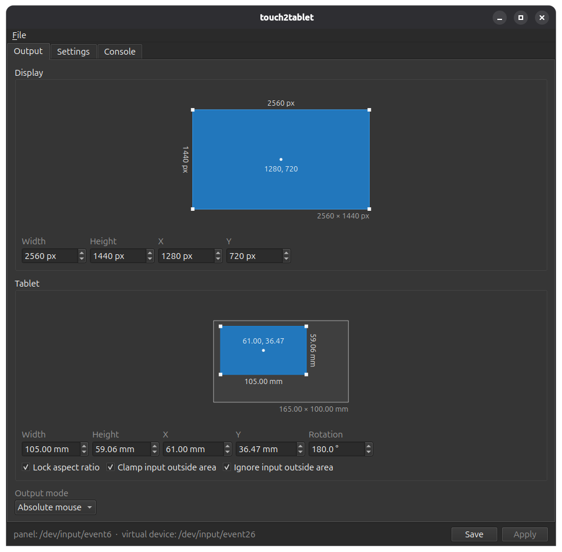
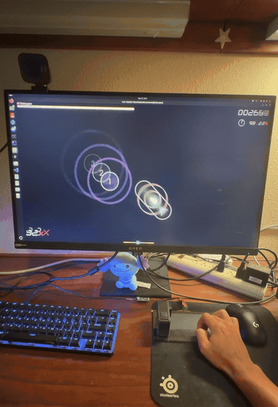

# touch2tablet

Cross platform, user mode daemon and [OpenTabletDriver](https://github.com/OpenTabletDriver/OpenTabletDriver)-style GUI that turns a multitouch panel into an absolute-positioned tablet. Runs on Linux and [Windows](docs/windows.md).



*GUI*



*Using touch2tablet to play osu! on a 165 × 100 mm GT911 touchscreen controller*

## Supported Hardware

See [Supported Panels](docs/supported-panels.md) for compatible devices and how to add one.

## Quick Start (Linux)

You need udev, a systemd user session, CMake 3.22+, Ninja, a C++20 compiler, Qt 6.5+,
`pkg-config` and libevdev. On Debian-based distributions:

```bash
sudo apt install build-essential cmake ninja-build pkg-config qt6-base-dev libevdev-dev
./scripts/install-user.sh
```

Plug in a supported panel and the service should grab it and present "touch2tablet Absolute
Mouse" ("touch2tablet Pen Tablet" in [pen mode](#output-modes)). Open **touch2tablet** from the
application menu, or run `touch2tablet`, to edit the mapping.

The daemon runs as a systemd user service:

```bash
systemctl --user status touch2tablet
journalctl --user -u touch2tablet -f            # follow the daemon log
systemctl --user reload touch2tablet            # re-read settings.json
systemctl --user disable --now touch2tablet     # back to plain touchscreen behavior
```

## Settings and Presets

Settings live in `~/.config/touch2tablet/settings.json` (`%LOCALAPPDATA%\touch2tablet\settings.json` on Windows).

```
display       {width, height, width_mm, height_mm, output}  monitor size in px and mm
display_area  {width, height, x, y}                         px, center-based
tablet        {width, height}                               glass size in mm, from panels.json
tablet_area   {width, height, x, y, rotation}               mm, center-based, degrees clockwise
clip, limit   bools                                         see How It Works
lock_aspect   bool                                          GUI hint only
output_mode   "mouse" or "pen"                              see Output Modes
```

`display.output` names a Windows monitor (empty means the primary one) and Linux ignores it.

Presets are settings files in the `presets` folder next to the settings file. **File > Save as
preset...** writes one and **File > Presets** applies one. A preset can be partial, e.g. only
`tablet_area`.

## How It Works

touch2tablet grabs the panel's multitouch input and turns the first finger into a single
absolute pointer, so applications see an absolute mouse (or a pen tablet in pen mode) instead of
a touchscreen. The daemon:

1. converts the panel's raw coordinates into millimeters on the glass,
2. applies the tablet area (position, size and rotation),
3. scales the result into the display area,
4. and moves the virtual mouse or pen there.

Output always stays on the display. With `clip`, a touch outside the tablet area is held at the
area's nearest edge. With `limit`, a stroke that starts outside the tablet area is ignored until
*every* finger has lifted.

### Touch Behavior

Only the first finger controls the pointer; additional contacts don't affect the stroke. The
finger acts as a held left button (a pressed pen tip in pen mode), with no pressure, hover or
right click. When it lifts, the stroke ends, and any fingers still on the panel are ignored
until all of them have lifted.

### Output Modes

`output_mode` (**Output mode** in the GUI) sets what applications see:

- `mouse` (default): an absolute mouse, which works wherever a mouse does. On Wayland,
  applications that lock the pointer for relative motion, such as games with a raw or high
  precision mouse option, get no movement from it; turn that option off. A left-handed mouse
  setting turns taps into right clicks.
- `pen` (Linux only): a pen tablet, for applications that read pen input. Some applications
  treat pen input differently from a mouse, or not at all.

In mouse mode the compositor spreads the device over the whole desktop, so with several monitors
set `display` to the whole desktop and place `display_area` on the monitor you want.

## Development

See [CONTRIBUTING.md](CONTRIBUTING.md). The control socket protocol is in
[docs/protocol.md](docs/protocol.md).

## Uninstall

Stop the service and remove the installed user files and system-wide udev rule:

```bash
systemctl --user disable --now touch2tablet.service
rm -f "$HOME/.config/systemd/user/touch2tablet.service"
rm -f "$HOME/.local/bin/touch2tabletd" "$HOME/.local/bin/touch2tablet"
rm -f "$HOME/.local/share/applications/touch2tablet.desktop"
systemctl --user daemon-reload
sudo rm -f /etc/udev/rules.d/70-touch2tablet.rules
sudo udevadm control --reload
sudo udevadm trigger
```

This leaves settings and presets in `~/.config/touch2tablet/`; delete that directory too if you no
longer want them.

## License

[MIT](LICENSE)
